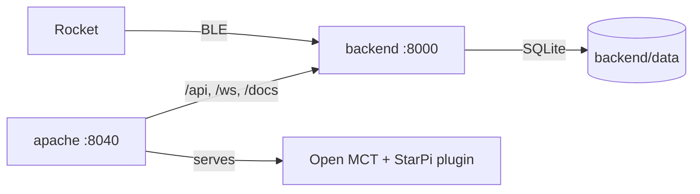

# Ground Station Software

This repository contains all software components of the ground station.

## Hardware

This project uses:
- [Raspberry Pi 4](https://www.raspberrypi.com/products/raspberry-pi-4-model-b/) as the main computer
- LoRa module hat for communication with rocket mcu
- (TODO): An HDMI monitor for quick data visualization and debugging

## Software

The software stack involves the following components:
- [Open MCT](https://nasa.github.io/openmct/) for telemetry visualization
- Python backend for data processing and communication with the LoRa module and Bluetooth LE
- SQLite database for data storage and retrieval

## Getting Started

Prerequisites: Docker with Compose, and BlueZ on the host for the rocket link.

```sh
sh backend/scripts/setup-bluetooth.sh   # power on the Bluetooth controller
docker compose up -d --build
```

Then open <http://localhost:8040> and log in as `testuser` / `NasaIsCool!`
(stored in `apache/.htpasswd`; replace it before flying). The **StarPi** folder
in the tree holds one telemetry object per message type, ready to be plotted,
tabled or dropped into a layout. The indicator in the top bar shows whether the
backend is reachable and which rocket links are up.

No rocket at hand? Run the same stack on the built-in simulator:

```sh
SP_LINKS=sim SP_DB_PATH=/data/simulator.db docker compose up -d --build
```

| Service | What it does | URL |
| --- | --- | --- |
| `apache` | Serves Open MCT and proxies the backend under one login | <http://localhost:8040> |
| `backend` | Decodes, stores and streams telemetry, sends commands | <http://localhost:8040/docs> (also `:8000` directly) |

Compose settings, all optional: `SP_LINKS` (`ble`), `SP_DB_PATH`
(`/data/starpi.db`, stored in `backend/data/`), `FRONTEND_PORT` (`8040`),
`BACKEND_PORT` (`8000`). Put machine-specific values in a git-ignored `.env`
(start from `.env.example`); Compose reads it automatically.



### Frontend

`openmct/` holds the Open MCT site: `starpi-app.js` configures Open MCT and
`starpi-plugin.js` connects it to the backend — history from `GET /api/packets`,
live data from the `/ws` websocket. Open MCT itself comes from npm, pinned in
`openmct/package.json`, and is built into the `apache` image. Layouts and
notebooks are saved in the browser's local storage, so they stay on the machine
that made them.

### Backend

`backend/` holds the Python service: it decodes telemetry frames, stores them
in SQLite, pushes them to websocket clients and forwards commands back to the
rocket. `cd backend && make build && make run` brings it up on
<http://localhost:8000>, where `/docs` is the generated API reference (`/`
redirects there).

Open MCT is the telemetry front end; the backend also bundles a bare-bones
dashboard for quick checks, which is opt-in — `SP_SERVE_WEB=true` serves it at
`/`, and `make run-web` does that for you. See
[backend/README.md](backend/README.md) for the API, the protocol and the full
list of settings.
