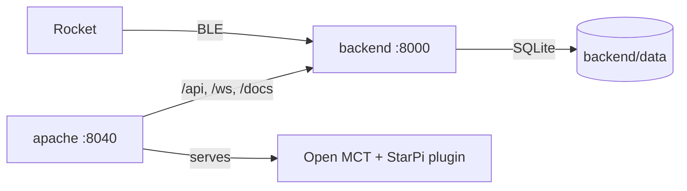

# Ground Station Software

This repository contains all software components of the ground station.

## Hardware

This project uses:
- [Raspberry Pi 4](https://www.raspberrypi.com/products/raspberry-pi-4-model-b/) as the main computer
- LoRa module hat for communication with rocket mcu
- (TODO): An HDMI monitor for quick data visualization and debugging

## Software

The software stack involves the following components:
- [Open MCT](https://nasa.github.io/openmct/) for telemetry visualization
- Python backend for data processing and communication with the LoRa module and Bluetooth LE
- SQLite database for data storage and retrieval

## Getting Started

Prerequisites: Docker with Compose, and BlueZ on the host for the rocket link.

```sh
sh backend/scripts/setup-bluetooth.sh   # power on the Bluetooth controller
docker compose up -d --build
```

Then open <http://localhost:8040> and log in as `testuser` / `NasaIsCool!`
(stored in `apache/.htpasswd`; replace it before flying). The **StarPi** folder
in the tree holds one telemetry object per message type, ready to be plotted,
tabled or dropped into a layout. The indicator in the top bar shows whether the
backend is reachable and which rocket links are up.

No rocket at hand? Run the same stack on the built-in simulator:

```sh
SP_LINKS=sim SP_DB_PATH=/data/simulator.db docker compose up -d --build
```

| Service | What it does | URL |
| --- | --- | --- |
| `apache` | Serves Open MCT and proxies the backend under one login | <http://localhost:8040> |
| `backend` | Decodes, stores and streams telemetry, sends commands | <http://localhost:8040/docs> (also `:8000` directly) |

Compose settings, all optional: `SP_LINKS` (`ble`), `SP_DB_PATH`
(`/data/starpi.db`, stored in `backend/data/`), `FRONTEND_PORT` (`8040`),
`BACKEND_PORT` (`8000`). Put machine-specific values in a git-ignored `.env`
(start from `.env.example`); Compose reads it automatically.



### Frontend

`openmct/` holds the Open MCT site. Open MCT itself comes from npm, pinned in
`openmct/package.json`, and is built into the `apache` image.

The **StarPi** tree follows Open MCT's conventions: one telemetry object per
measured quantity, grouped by subsystem, each with its unit and display
precision, so any standard view can combine them.

| Folder | Contents |
| --- | --- |
| Flight (estimated) | Flight phase, mission time, altitude above ground, apogee, max speed/acceleration, distance and bearing from the pad, ground track |
| Barometer | Altitude (MSL), vertical speed, pressure, temperature |
| IMU | Acceleration, angular rate, orientation: each opens as X/Y/Z overlaid and expands to the single axes |
| GPS | Latitude, longitude |
| Ground station | Rocket link state, packet rate, errors, dropped events |
| System log | The rocket's log messages |

History comes from `GET /api/packets`, live data from the `/ws` websocket.
Values turn *stale* (Open MCT's hatched style) when their message type has not
arrived for 5 s. The real-time window ends 5 s in the future, so fresh packets
are never dropped by views that ignore data past the window's end.

`starpi-plugin.js` is the telemetry plugin, `flight/` the flight estimates,
`dashboard/seed.js` the standard dashboard, `commands/` the command panel and
`launch-control/` the custom dashboard.

### Flight dashboards

There are two, to compare:

* **My Items › StarPi Flight Dashboard › Flight Dashboard** (the page Open
  MCT opens on) is built only from standard Open MCT objects: a Display Layout
  with Condition Widgets for the flight phase and alarms, a Stacked Plot, a
  Scatter Plot of the ground track, Overlay Plots, a Gauge, LAD tables and a
  Telemetry Table. Everything can be edited from the UI (the pencil button):
  move and resize items, restyle them, change the alarm thresholds in *Alarm
  conditions*. It lives in the browser's local storage: delete the *StarPi
  Flight Dashboard* folder and reload to get the original back.
* **StarPi › Launch Control** is the custom view: the same data in a
  purpose-built layout, fixed but denser.

Both follow the time conductor at the bottom: *Real-time* shows the live
flight, *Fixed* replays any past window. The only custom piece in the standard
dashboard is **Commands** (Open MCT has no commanding UI without YAMCS): each
command needs a second click to confirm and is disabled while its link is down.

### Flight estimates and calibration

The rocket reports no flight phase, ground level or pad position, so
`openmct/flight/flight-state.js` estimates them from barometric altitude and
speed, the accelerometer and GPS:

* **Ground level**: the median barometric altitude while on the pad.
* **Flight phase**: launch when acceleration stays above 2 g for 200 ms (or
  the vertical speed passes 15 m/s), burnout below 1.2 g, apogee when the
  vertical speed turns negative, landed after 5 s still within 15 m of the
  ground.
* **Pad position**: the average GPS fix before launch.

The thresholds live in **My Items › StarPi Flight Dashboard › Flight
settings**: change them with *Edit Properties*, and every flight view picks
them up at once. A ground level set there replaces the pad median; Launch
Control's *Set ground here* does the same for that view only.

`node --test openmct/flight/flight-state.test.js` runs the estimation tests.

### Backend

`backend/` holds the Python service: it decodes telemetry frames, stores them
in SQLite, pushes them to websocket clients and forwards commands back to the
rocket. `cd backend && make build && make run` brings it up on
<http://localhost:8000>, where `/docs` is the generated API reference (`/`
redirects there).

Open MCT is the telemetry front end; the backend also bundles a bare-bones
dashboard for quick checks, which is opt-in — `SP_SERVE_WEB=true` serves it at
`/`, and `make run-web` does that for you. See
[backend/README.md](backend/README.md) for the API, the protocol and the full
list of settings.
