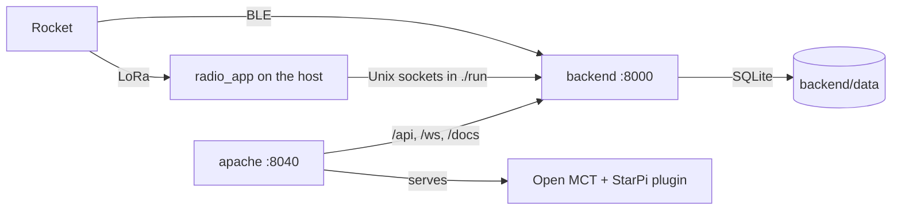

# Ground Station Software

This repository contains all software components of the ground station.

## Hardware

This project uses:
- [Raspberry Pi 4](https://www.raspberrypi.com/products/raspberry-pi-4-model-b/) as the main computer
- LoRa module hat for communication with rocket mcu
- (TODO): An HDMI monitor for quick data visualization and debugging

## Software

The software stack involves the following components:
- [Open MCT](https://nasa.github.io/openmct/) for telemetry visualization
- Python backend for data processing and communication with the LoRa module and Bluetooth LE
- SQLite database for data storage and retrieval

## Getting Started

Prerequisites: Docker with Compose, Make, and BlueZ on the host for the
Bluetooth rocket link. The LoRa link also needs the firmware's `radio_app`
running on the Pi (see [LoRa link](#lora-link)).

```sh
make up   # power on the Bluetooth controller, build, start, wait until healthy
```

Then open <http://localhost:8040>; there is no login. The **StarPi** folder in
the tree holds one telemetry object per message type, ready to be plotted,
tabled or dropped into a layout. The indicator in the top bar shows whether the
backend is reachable and which rocket links are up.

No rocket at hand? Run the same stack on the built-in simulator:

```sh
make sim                  # 350 pkt/s, a little above the rocket's ~300
make sim SP_SIM_RATE=500  # or any other rate
make sim2                 # the same flight over two radios: BLE and LoRa
```

`make down` stops the stack, `make logs` follows it (`S=backend` for one
service), `make test` runs the frontend tests and `make` lists every target.
The Makefile only wraps `docker compose`, which still defines the services, so
plain `docker compose` commands keep working.

| Service | What it does | URL |
| --- | --- | --- |
| `apache` | Serves Open MCT and proxies the backend on one port | <http://localhost:8040> |
| `backend` | Decodes, stores and streams telemetry, sends commands | <http://localhost:8040/docs> (also `:8000` directly) |

Apache's status page (`/server-status`) answers only from inside its own
container, since the site has no login; a browser gets `403`. Read it with
`docker compose exec apache wget -qO- http://localhost/server-status?auto`.

Compose settings, all optional: `SP_LINKS` (`ble`; `ble,lora` adds the LoRa
link), `LORA_SOCKET_DIR` (`./run`, the directory shared with `radio_app`),
`SP_DB_PATH`
(`/data/starpi.db`, stored in `backend/data/`; every start writes a new file
named after it, see below), `FRONTEND_PORT` (`8040`),
`BACKEND_PORT` (`8000`). Put machine-specific values in a git-ignored `.env`
(start from `.env.example`); Compose reads it automatically, and the same
variables can go on the `make` command line: `make up FRONTEND_PORT=9000`.


```mermaid
graph LR
    R[Rocket] -- BLE --> B[backend :8000]
    R -- LoRa --> L[radio_app on the host]
    L -- "Unix sockets in ./run" --> B
    B -- SQLite --> D[(backend/data)]
    A[apache :8040] -- "/api, /ws, /docs" --> B
    A -- serves --> O[Open MCT + StarPi plugin]
```

### LoRa link

The LoRa radio is driven by `radio_app`, a program from the firmware
repository (`app/raspberry/` in `mcu`) that runs on the Pi itself, outside
Docker. The backend's `lora` link talks to it over two Unix sockets in a
directory both can see: `./run` here, mounted into the backend container.

```sh
# once: build radio_app (in the mcu repository, on the Pi)
cmake -S app/raspberry -B app/raspberry/build && cmake --build app/raspberry/build

make up SP_LINKS=ble,lora                              # creates ./run, starts the stack
/path/to/mcu/app/raspberry/build/radio_app "$PWD/run"  # in another terminal, from this directory
```

The order does not matter and either side can be restarted alone: the backend
retries every 2 s until `radio_app` is there. Put `SP_LINKS=ble,lora` in `.env`
to keep it. Without an argument `radio_app` uses `/tmp`, which is where a
backend run outside Docker looks for it; another directory goes in
`LORA_SOCKET_DIR` (keep the path short: a socket path cannot exceed 107
characters). `radio_app` has to run as a user allowed to write to that
directory, so let `make up` create it rather than Docker, which would make it
root's.

`GET /api/health` tells the two states apart: the `lora` link is `connected`
only while the rocket is on the LoRa link; `radio_app: true` with
`connected: false` means the radio is running and waiting for the rocket.
LoRa carries a summary of the telemetry (altitude and vertical speed, the two
pressures, GPS position, flight state), stored like every other packet with
`link: "lora"`; see [backend/README.md](backend/README.md#lora-link).

### Pi without internet

`make up` builds the images, which downloads base images and packages. When
the Pi is offline, build on a computer that is online and ship the images:

```sh
make deploy PI=starpi@starpi.local   # build for the Pi, load the images over SSH
```

The build runs the Pi's programs under QEMU, which it sets up and removes by
itself through privileged containers, so it is slower than a native build.

No network path to the Pi? `make bundle` writes `starpi-images.tar.gz`
instead. Copy it next to the Makefile on the Pi and run `make load` there.
Either way, start the stack on the Pi without rebuilding, with the dashboard
on the default HTTP port (<http://starpi.local>):

```sh
make pi    # or, on port 8040: make up BUILD=--no-build (make sim BUILD=--no-build)
```

The images target 64-bit Raspberry Pi OS. For a 32-bit OS, add
`PLATFORM=linux/arm/v7`.

### Field Wi-Fi

In the field there is no router, so the Pi can host its own Wi-Fi network:

```sh
make hotspot PASSWORD=choose-a-password   # SSID=StarPi by default
```

From the next boot on, the Pi broadcasts `StarPi` (WPA2, 5 GHz channel 36, to
stay clear of the 2.4 GHz BLE link) instead of joining another network. Devices
that join get an address over DHCP and reach the dashboard at
<http://starpi.local> (or <http://10.42.0.1>) after `make pi`, and SSH at
`starpi.local`; the hotspot's DNS server answers that name. The containers
restart with Docker on boot, so the dashboard comes back on its own. Saved
networks stay as a fallback if the hotspot cannot start. `sudo nmcli connection down
starpi-hotspot` switches back to them until the next boot, and `sudo nmcli
connection delete starpi-hotspot` removes the hotspot for good.

For a laptop on a direct Ethernet cable:

```sh
make lan            # IFACE=eth0 by default
```

The Pi's Ethernet port then serves its own network (`10.43.0.1/24`, with
DHCP), right away and on every boot: the laptop needs no settings and reaches
the dashboard at <http://starpi.local> (or <http://10.43.0.1>) after `make pi`, and
SSH at `starpi.local`. As on the hotspot, the Pi's DNS server answers that name,
each network with the Pi's own address on it. The port hands out addresses, so
don't plug it into a router while this is on; `sudo nmcli connection delete
starpi-lan` undoes it.

### Frontend

`openmct/` holds the Open MCT site. Open MCT itself comes from npm, pinned in
`openmct/package.json`, and is built into the `apache` image.

The **StarPi** folder is the ground station's own: its top level holds only
the dashboards (today **Launch Control**), **Telemetry** every quantity,
measured or estimated, and **Widgets** the custom views that dashboards embed
(Rocket Attitude, Commands). Telemetry follows Open MCT's conventions: one
object per measured quantity, grouped by subsystem, each with its unit and
display precision, so any standard view can combine them.

| StarPi › Telemetry › | Contents |
| --- | --- |
| Flight | Flight phase (reported by the rocket), mission time, altitude above ground, total and lateral acceleration (across the long axis, IMU Z), apogee, max speed/acceleration, distance and bearing from the pad, ground track |
| Barometer | Altitude (MSL), vertical speed, pressure and temperature of each of the two barometers |
| IMU | Acceleration, angular rate, orientation: each opens as X/Y/Z overlaid and expands to the single axes |
| GPS | Latitude, longitude |
| Ground station | Rocket link state, packet rate, errors, dropped events |
| System log | The rocket's log messages |

History comes from `GET /api/packets`, live data from the `/ws` websocket.
Values turn *stale* (Open MCT's hatched style) when their message type has not
arrived for 5 s. The real-time window ends 5 s in the future, so fresh packets
are never dropped by views that ignore data past the window's end.

Time is the rocket's own. Its clock only knows the date once GPS has set it,
which may never happen, so the *Real-time* conductor follows the **Rocket
clock** rather than this computer's: the newest packet's timestamp, run on
between packets for up to 10 s, then held until the rocket is heard again. It
jumps back when the rocket's clock does (a restart). Until GPS sets it, times
show as dates in January 1970: the hours are time since the rocket booted.

So that two runs never mix their timestamps, the backend starts a new database
file every time it starts: `SP_DB_PATH=/data/starpi.db` names the series,
`starpi-0001-20261003-142501.db`, `starpi-0002-...` (run number, then the
Pi's UTC time). The frontend reloads when it sees a backend from a new run.
Older runs stay in `backend/data/`.

`starpi-plugin.js` is the telemetry plugin, `flight/` the flight state,
`dashboard/seed.js` the standard dashboard, `commands/` the command panel,
`launch-control/` the custom dashboard, `rocket/` the 3D attitude view and
`brand/` the team's look (see below).

### Brand

`openmct/brand/` gives Open MCT and every StarPi view the team's identity, from
the circular mission patch: colours, the Inter typeface, the logo in the
header and the About dialog, the favicon.

* `brand.css` is the only place colours are written down: the patch palette
  (`--sp-night`, `--sp-space`, `--sp-red`, `--sp-orange`, `--sp-gold`, ...)
  and the roles views use (`--sp-bg`, `--sp-panel`, `--sp-ink`,
  `--sp-accent`, `--sp-data`, `--sp-ok` / `--sp-warn` / `--sp-alarm`), for both
  dark and light mode. A new view uses the roles and follows both themes for
  free. It also styles the patch + wordmark lockup (`.sp-lockup`).
* `brand.js` (`window.StarPiBrand`) gives scripts the same: `color('accent')`
  for canvases, `lockup()` markup, asset paths, and the Open MCT plugin that
  sets the header logo and the About text.
* `openmct-overrides.css` restyles Open MCT's header and About dialog;
  `openmct-accent.css` swaps Open MCT's blue for the brand accent. The latter
  is generated by `python3 scripts/openmct-accent.py`: rerun it after upgrading
  Open MCT.
* `assets/` holds the patch (PNG) and the wordmarks (SVG outlines of the
  Nasalization typeface, whose licence allows logos but not web fonts), made
  by `python3 scripts/brand-assets.py PATCH.xcf NASALIZATION.otf`.

### Flight dashboards

There are two, to compare:

* **My Items › StarPi Flight Dashboard › Flight Dashboard** is built only
  from standard Open MCT objects: a Display Layout with Condition Widgets for
  the flight phase and alarms, a Stacked Plot, a Scatter Plot of the ground
  track, Overlay Plots, a Gauge, LAD tables and a Telemetry Table. Everything can be edited from the UI (the pencil button):
  move and resize items, restyle them, change the alarm thresholds in *Alarm
  conditions*. It lives in the browser's local storage: delete the *StarPi
  Flight Dashboard* folder and reload to get the original back.
* **StarPi › Launch Control** (the page Open MCT opens on) is the custom
  view: the same data in a purpose-built layout, fixed but denser.

**StarPi › Widgets › Rocket Attitude** (also on the standard dashboard and in
Launch Control) is a 3D model of the rocket turned to its reported
orientation, with cues for its reported flight state: an exhaust flame during
the burn, then a small drogue and the main parachute as they deploy. Drag to
orbit, double-click to
reset. It takes the IMU's Z as the rocket's long axis and applies the X, Y, Z
angles in that order (`EULER_ORDER` in `openmct/rocket/rocket-view.js`); one
fin is blue so the roll shows. three.js comes from npm like Open MCT.

### Offline launch site map

Launch Control's *Position from pad* plot can sit over a map of the launch
site: switch it between **Off**, **Map** (OpenStreetMap) and **Satellite**
above the plot. The choice is remembered per browser. The map follows the
plot, centred on the pad and at the rings' scale; it cannot be panned.

Nothing is fetched at the field. `make tiles` downloads the site once, on a
computer with internet and Docker, into `openmct/tiles/`, and the next image
build (`make up`, `make deploy`, ...) includes it:

```sh
make tiles LAT=39.392547 LON=-8.289517 RADIUS=5   # defaults: competition pad A, 5 km
make up                                      # or make deploy PI=...
```

* **Map**: an extract of the [Protomaps](https://protomaps.com) daily
  OpenStreetMap build (vector tiles in one `map.pmtiles`, a few MB for 10 km
  across, ~12 MB for a city centre), drawn by MapLibre GL with Protomaps' dark
  style. Its fonts and icons are downloaded alongside. The browser loads
  MapLibre (~1 MB) only once a map is switched on.
* **Satellite**: raster tiles, by default EOX's
  [Sentinel-2 cloudless](https://s2maps.eu) (CC BY-NC-SA 4.0). It is free and
  worldwide but only 10 m per pixel, so fields show and a pad doesn't. For
  more detail, point `SAT_URL` at a sharper source you are allowed to store,
  such as your country's open orthophotos, and set `SAT_MAXZOOM` and
  `SAT_ATTRIBUTION` to match (`SAT_URL=` skips satellite). See
  `scripts/fetch-tiles.py`.

Without `openmct/tiles/site.json` there is no toggle and the plot is drawn on
its own, as before. The downloaded files are not committed.

Licences: the map shows its credits in the corner (the ⓘ button). OpenStreetMap
data is under the ODbL, Protomaps' style is CC0, the Noto Sans label font is
under the SIL OFL and the icons are MIT; `make tiles` writes all of them to
`openmct/tiles/LICENSES.md`, with the font and icon licence texts beside their
files. The default satellite imagery is **non-commercial only** (CC BY-NC-SA
4.0); set `SAT_LICENSE` with your own source. MapLibre, pmtiles and
@protomaps/basemaps are BSD-3-Clause; their texts are in `openmct/licenses/`,
served at `/licenses/`.

Both follow the time conductor at the bottom: *Real-time* shows the live
flight, *Fixed* replays any past window. The only custom piece in the standard
dashboard is **Commands** (Open MCT has no commanding UI without YAMCS): each
command is one row with a send button per link, needs a second click to confirm
and is disabled while that link is down. The commands that fire a charge
(`eject_a`, `eject_c`, `cut_main`) sit in their own box and must be unlocked
first; they lock again after 30 s.

### Flight state and ground level

The rocket reports its flight state (`T_ROCKET_STATE`: idle, boost, coast,
drogue, main, touchdown), and the parachutes follow from it.
`openmct/flight/flight-state.js` derives the rest from the reported state,
barometric altitude and speed, the accelerometer and GPS:

* **Launch time**: when the state first leaves idle. A page opened mid-flight
  finds it in the last 10 minutes of history; before that, mission time stays
  blank.
* **Apogee**: the highest altitude before the drogue (or main) is reported.
* **Ground level**: the median barometric altitude while idle on the pad.
* **Pad position**: the average GPS fix while idle on the pad.

A ground level set in **My Items › StarPi Flight Dashboard › Flight
settings** (*Edit Properties*) replaces the pad median for every flight view;
Launch Control's *Set ground here* does the same for that view only.

`make test` (`node --test openmct/flight/flight-state.test.js`) runs the
flight-tracking tests.

### Backend

`backend/` holds the Python service: it decodes telemetry frames, stores them
in SQLite, pushes them to websocket clients and forwards commands back to the
rocket. `cd backend && make build && make run` brings it up on
<http://localhost:8000>, where `/docs` is the generated API reference (`/`
redirects there).

Open MCT is the telemetry front end; the backend also bundles a bare-bones
dashboard for quick checks, which is opt-in — `SP_SERVE_WEB=true` serves it at
`/`, and `make run-web` does that for you. See
[backend/README.md](backend/README.md) for the API, the protocol and the full
list of settings.

## License

StarPi ground station is free software, licensed under the
[GNU General Public License v3.0](LICENSE). Open MCT, which the frontend is
built on, is Apache-2.0 (© United States Government, NASA); its notice is in
[openmct/licenses/openmct.txt](openmct/licenses/openmct.txt), beside the
licences of the map libraries.
